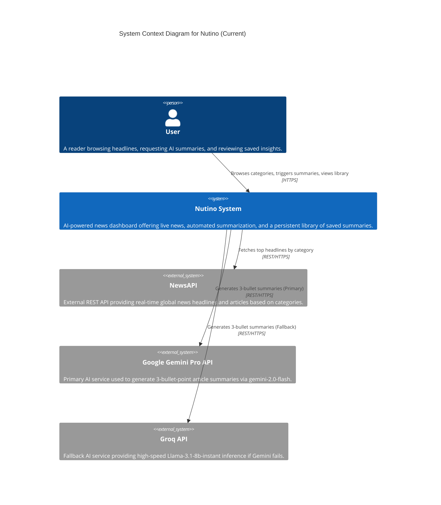
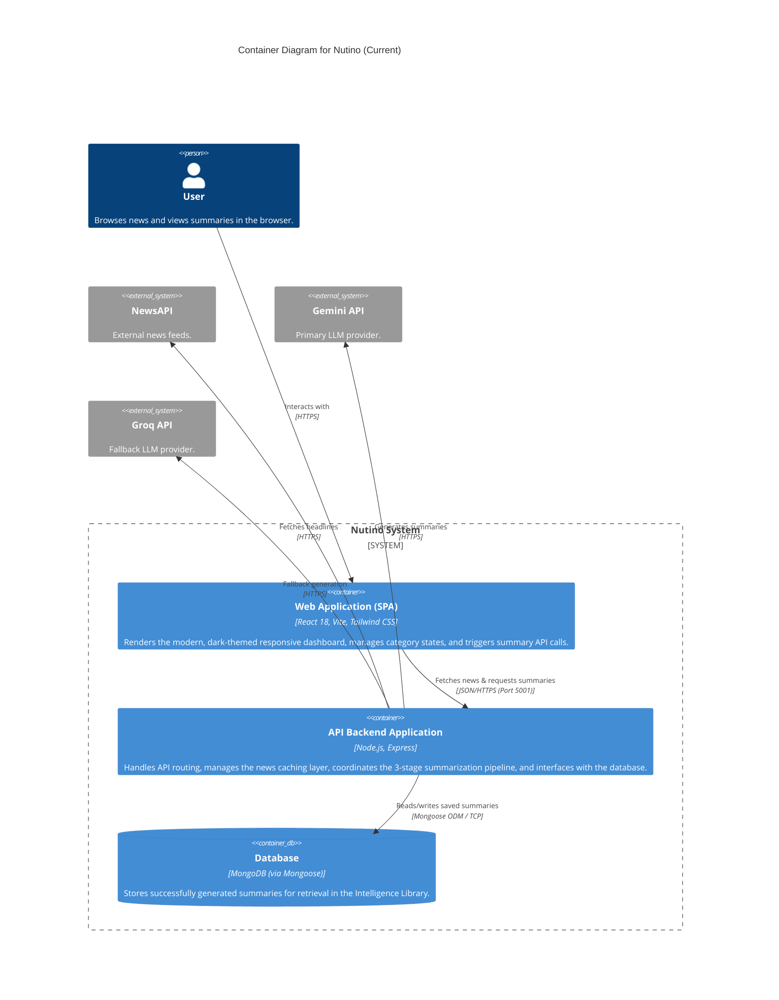
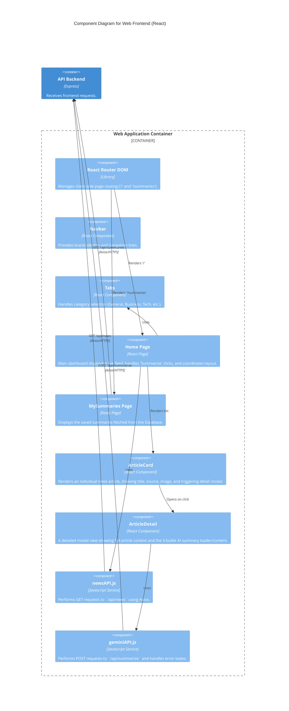
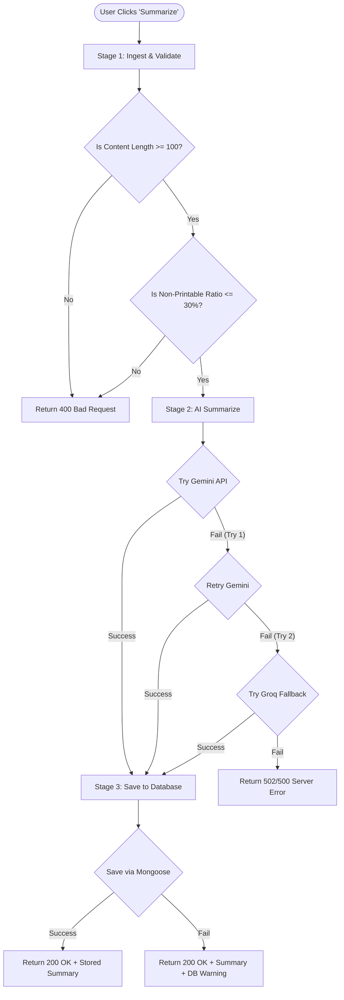
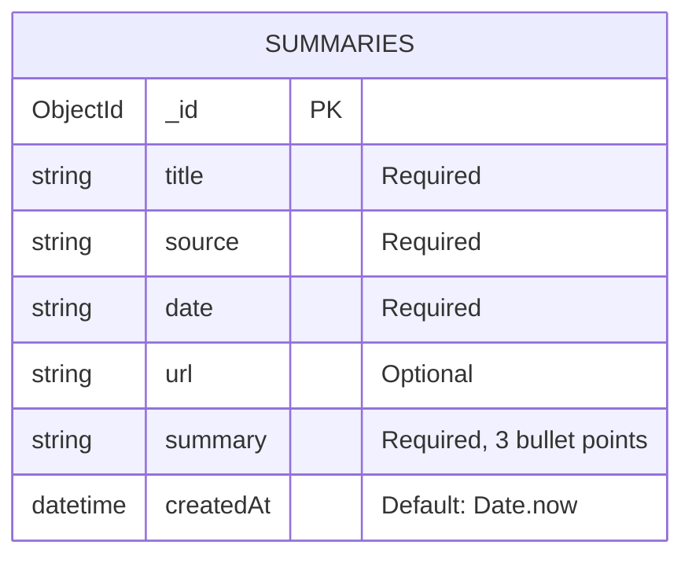

# C4 Architecture Diagrams — Current "As-Is" System

This document provides a comprehensive C4 model representation of the **Nutino** system as it is **currently implemented in the codebase**. Unlike theoretical or future-state diagrams, this reflects the exact active components, data flows, and technologies present in the `/01newssum` (Frontend) and `/server` (Backend) directories.

> [!NOTE]
> **Key Distinctions of the Active Implementation:**
> - **Authentication:** User authentication and registration are not currently implemented or mounted on the backend routes.
> - **Caching:** Instead of an external Redis cluster, the backend uses a local, in-memory Node.js cache object in `newsRoutes.js` with a 5-minute TTL to throttle NewsAPI requests.
> - **Fallback Engine:** The summarization backend includes a dual-LLM pipeline: it tries **Google Gemini Pro (`gemini-2.0-flash`)** first, and falls back to **Groq (`llama-3.1-8b-instant`)** if Gemini fails or is rate-limited.

---

## 📂 System C4 Level 1: Context Diagram

The Context diagram shows how users interact with the Nutino dashboard, and how Nutino integrates with external APIs to fetch live news and generate AI-driven summaries.

---

## 📦 System C4 Level 2: Container Diagram

The Container diagram decomposes the Nutino system into its executable components: the Single Page Application (SPA), the API Backend service, and the persistent Database.

---

## 🧩 System C4 Level 3: Component Diagrams

### 1. Web Frontend Component Diagram (`/01newssum`)

Decomposes the client side into pages, UI components, state management, and the Axios API service layer.

---

### 2. API Backend Component Diagram (`/server`)

Decomposes the Express application into routers, controllers, the core pipeline engine, models, and custom utility scripts.

```mermaid
C4Component
    title Component Diagram for API Backend (Express)

    Container_Boundary(backend, "API Backend Container") {
        Component(server, "Express App (index.js)", "Node.js / Express", "Initializes middlewares (CORS, JSON parser), connects to database, and mounts routes.")
        
        Component(newsRouter, "News Router (newsRoutes.js)", "Express Router", "Defines `/api/news` route. Manages local caching logic.")
        Component(newsCache, "newsCache", "In-Memory Object", "Caches NewsAPI results by category with a 5-minute TTL.")
        
        Component(summarizeRouter, "Summarize Router (summarizeRoutes.js)", "Express Router", "Defines `/api/summarize` (single) and `/api/summarize/batch` routes.")
        Component(summarizeCtrl, "Summarize Controller (summarizeController.js)", "Javascript Controller", "Handles client payloads, orchestrates the 3-stage pipeline, and aggregates batch responses.")
        
        Component(summaryRouter, "Summary Router (summaryRoutes.js)", "Express Router", "Defines GET and POST routes for `/api/summaries`.")
        Component(summaryCtrl, "Summary Controller (summaryController.js)", "Javascript Controller", "Directly saves summaries to or fetches all summaries from the DB.")
        
        Component(pipeline, "Pipeline Engine (pipeline.js)", "Core Service Module", "Encapsulates the core processing engine in 3 decoupled stages.")
        
        Component(ingestStage, "ingestArticle()", "Stage 1 Function", "Validates character counts (min 100), trimming, and checks non-printable character ratio (< 30%).")
        Component(summarizeStage, "summarizeArticle()", "Stage 2 Function", "Triggers LLM calls. Manages Gemini Pro attempts, retry pauses, and Groq fallback.")
        Component(storeStage, "storeSummary()", "Stage 3 Function", "Maps successful summaries to Mongoose entities and saves to MongoDB.")
        
        Component(summaryModel, "Summary Model (Summary.js)", "Mongoose Schema", "Defines the database entity structure (title, source, date, url, summary).")
        Component(logger, "Logger Pipeline (logger.js)", "Utility", "Handles structured stdout prefixing for each pipeline stage (`[INGEST]`, `[SUMMARIZE]`, `[STORE]`).")
    }

    Container(web_app, "Web Application", "React", "Sends frontend requests.")
    ContainerDb(mongodb, "MongoDB", "Database", "Stores persisted records.")
    System_Ext(newsapi, "NewsAPI", "External API")
    System_Ext(gemini, "Gemini API", "External API")
    System_Ext(groq, "Groq API", "External API")

    Rel(web_app, server, "HTTP Requests")
    Rel(server, newsRouter, "Mounts '/api/news'")
    Rel(server, summarizeRouter, "Mounts '/api/summarize'")
    Rel(server, summaryRouter, "Mounts '/api/summaries'")

    Rel(newsRouter, newsCache, "Checks / Writes")
    Rel(newsCache, newsapi, "Fetches headlines on cache miss", "HTTPS")

    Rel(summarizeRouter, summarizeCtrl, "Dispatches")
    Rel(summarizeCtrl, pipeline, "Calls pipeline stages")
    
    Rel(pipeline, ingestStage, "Ingests")
    Rel(pipeline, summarizeStage, "Summarizes")
    Rel(pipeline, storeStage, "Stores")
    
    Rel(summarizeStage, gemini, "Attempts primary inference", "REST/HTTPS")
    Rel(summarizeStage, groq, "Fallback on Gemini fail", "REST/HTTPS")
    
    Rel(summaryRouter, summaryCtrl, "Dispatches")
    Rel(summaryCtrl, summaryModel, "Uses")
    Rel(storeStage, summaryModel, "Saves document")
    
    Rel(summaryModel, mongodb, "TCP/IP Connection")
    
    Rel(pipeline, logger, "Logs pipeline states")
```

---

## 🔄 Core Data Flow: The 3-Stage AI Summarization Pipeline

A key design feature of Nutino is the sequential processing pipeline inside `server/pipeline/pipeline.js` when a user requests a summary:

---

## 🗄️ Database Entity Schema (MongoDB)

The data model for saved insights is simple and highly indexable.

